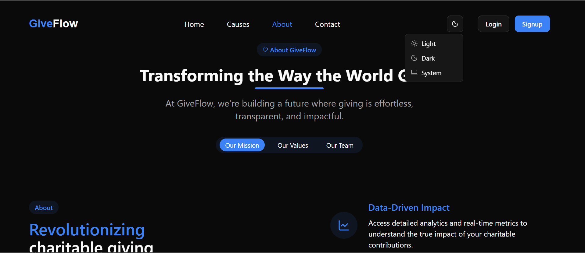
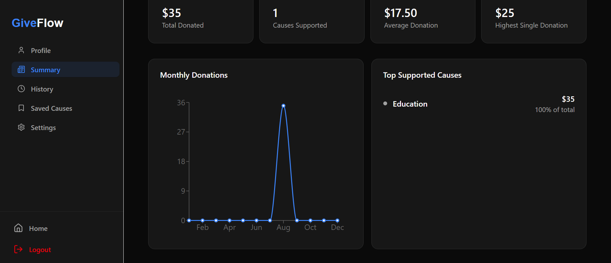
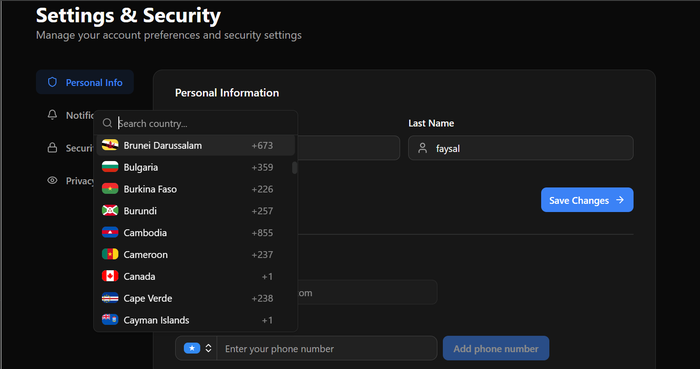
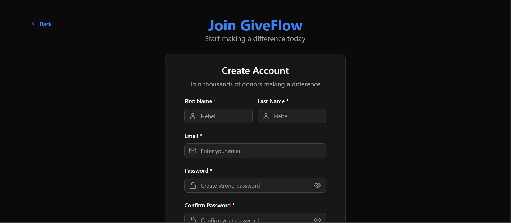

# 🌊 GiveFlow Frontend

GiveFlow is a modern donation platform that empowers individuals and organizations to raise funds while enabling donors to contribute with transparency and ease.  
This repository contains the **frontend application** built with **Next.js, TypeScript, and Tailwind CSS**.

<!-- Main banner image -->

  

---

## 🖼️ Preview

  
  
  

---

## ✨ Features
- 🎨 **Clean & responsive UI** with Tailwind CSS  
- 🔍 **Search & filter causes** by category, likes, and funding goals  
- ↕️ **Sort causes** (e.g., most liked, most urgent, amount needed)  
- ❤️ **Like & save causes** for later support  
- 🕵️ **Anonymous donations** for privacy  
- 👤 **User authentication & profiles**  
- 📊 **Real-time donation progress tracking**  
- ⭐ **Like & Saves** for causes 
- 🛡️ **Admin approval** required before publishing new causes  

---

## 🛠️ Tech Stack
- ⚛️ **Next.js** 
- 📦 **TypeScript**  
- 🎨 **Tailwind CSS**  
- 🔗 **Axios / React Query** for API requests  
- 🔒 **JWT Authentication**

---
